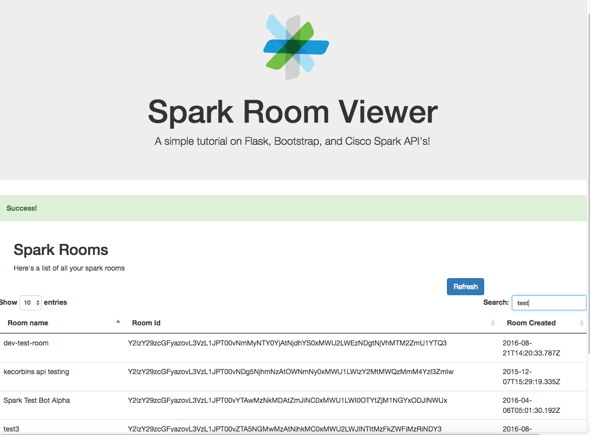

# spark-room-viewer

This application is designed as a basic introduction to Flask, Bootstrap, and Cisco Spark API's. You will be building a
small website that looks like this:




# Getting Started

The code in this repository is a starting point for the application.

1. Fork this repo
2. Clone the repo to your development machine.
3. Create a virutalenv and install requirements

```
cd spark-room-viewer
virtualenv venv
source venv/bin/activate
pip install -r requirements.txt
```

4. Add *SPARK_URL* and *SPARK_TOKEN* to your local environment.  You can get your spark token at https://developer.ciscospark.com/
```
export SPARK_URL=https://api.ciscospark.com/v1
export SPARK_TOKEN=<YOUR SPARK TOKEN>
```
5. Start the main application

```
python app.py
```

# Verification

At this point you should have a basic webserver up and running at http://127.0.0.1:5000/

# Lab Instructions

Once our basic website is up, let's start adding additional functionality, as well as making it prettier!!

## Introduction to Flask

[Flask](http://flask.pocoo.org/) is a microframework for web development in Python. A simple webserver application
can be defined as simply as:

```
from flask import Flask
app = Flask(__name__)

@app.route("/")
def hello():
    return "Hello World!"

if __name__ == "__main__":
    app.run()
```

For our application we will be building upon this framework.


## Introduction to Jinja templating

Jinja is a templating engine for python and allows us several key features.  Flask uses Jinja as the default templating engine
when generating html pages that are returned to the user. A working knowledge of Jinja is useful in other environments such as
Ansible

Jinja features include:

* Dynamic content generation
* Template inheritence - maximize code re-use, and providing consistent layout across multiple pages

For more information see [here](http://jinja.pocoo.org/)

### Extending an existing template for a new page

For this lab exercise, a base template has been provided in [base.html](./templates/base.html) we will use this to make our landing page
a little bit sexier! The base template also includes all of the CSS / Javascript you will need for the remainder of this
lab.


1. Create a new file in the templates directory called index.html and add the following code to it

```



{{ text }}

```

This is creating a new page, based off of base.html, whose body will contain the context data *text* which will be passed
to the template upon rendering.


2. Modify the URL route to use the template.

Change the following lines:

```
@app.route('/')
def hello():
    return "Hello World!"
```

to

```
@app.route('/')
def hello():
    return render_template('index.html', text="Hello World!")
```

3. Refresh the page.  you should now see a "jumbotron" box at the top of the page, containing some additional information
about the app we are building.

4. Explore the base.html template to see where the magic comes from.


## Introduction to Spark API's

The [Spark Developers site](https://developer.ciscospark.com) is a great resource for exploring the Spark API's.
For our application we are intersted in getting a list of spark rooms.


### Lab Exercise 1

For this excercise, you will complete the get_rooms function such that it contacts the Spark API, and returns a list of
rooms.  To test your code, simply press the refresh button on the rooms web page.

### Lab Exercise 2

Add a column in the web page that will display when the last activity in the room was

### Lab Exercise 3

Add another column that will display the number of members in each room.

### Bonus Exercise

Make the table sortable by any of the columns


